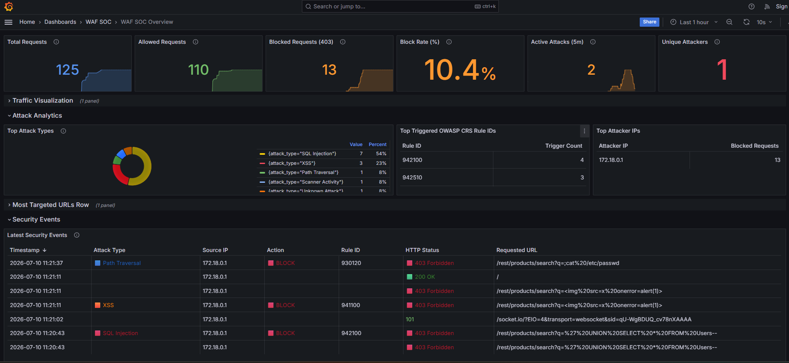

# 🛡️ Dockerized Nginx WAF & SOC Pipeline

> An industrial-grade Web Application Firewall (WAF) deployment using Nginx, ModSecurity, and the OWASP Core Rule Set (CRS). This project features a fully Dockerized Security Operations Center (SOC) logging pipeline using Grafana and Loki to visualize blocked attacks in real time.

---

## 📖 Table of Contents

- [🏗️ Architecture](#️-architecture)
- [🚀 Quick Start Deployment](#-quick-start-deployment)
- [⚔️ Testing the WAF (Proof of Concept)](#️-testing-the-waf-proof-of-concept)
- [📊 Visualizing Attacks (Grafana SOC)](#-visualizing-attacks-grafana-soc)
- [🛠️ Configuration Details](#️-configuration-details)
- [🛑 Teardown](#-teardown)

---

## 🏗️ Architecture

Traffic flows through the Nginx reverse proxy, where the ModSecurity engine evaluates HTTP requests against the OWASP Core Rule Set (CRS). Malicious requests are blocked (`403 Forbidden`) and logged. Promtail reads these logs and ships them to Loki, which Grafana queries to visualize attack activity in real time.

```text
[ Attacker / User ]
        │
        ▼ (Port 80)
┌────────────────────────────────────────┐
│             Nginx Reverse Proxy        │
│  ┌──────────────────────────────────┐  │      [ SOC Logging Pipeline ]
│  │ ModSecurity WAF Engine           │  │ ──┐   ┌──────────┐    ┌─────────┐    ┌─────────┐
│  │ (OWASP Core Rule Set)            │  │   ├──▶│ Promtail │──▶│  Loki   │──▶│ Grafana │
│  └──────────────────────────────────┘  │ ──┘   └──────────┘    └─────────┘    └─────────┘
└────────────────────────────────────────┘
        │ (Clean Traffic Only)
        ▼ (Port 3000)
┌────────────────────────────────────────┐
│            Vulnerable Web App          │
│            (OWASP Juice Shop)          │
└────────────────────────────────────────┘
```

---

## 🚀 Quick Start Deployment

### Prerequisites

Ensure you have the following installed:

- Docker
- Docker Compose

### Clone the Repository

```bash
git clone https://github.com/YOUR_USERNAME/industrial-waf-project.git
cd industrial-waf-project
```

### Launch the Infrastructure

```bash
docker compose up -d
```

### Verify Services

| Service | URL |
|---------|-----|
| OWASP Juice Shop | http://localhost |
| Grafana Dashboard | http://localhost:3000 |

> **Grafana credentials:** `admin / admin`.

Grafana is automatically provisioned with a Loki data source and the **WAF SOC Overview** dashboard on first startup. Open the dashboard directly from **Dashboards → WAF SOC → WAF SOC Overview**, or query Loki manually via **Explore**:

```logql
{job="modsecurity"}
```

Successful traffic is collected separately from the Nginx access log:

```logql
{job="waf-access"}
```

---

## ⚔️ Testing the WAF (Proof of Concept)

This repository includes a Python script that automatically tests whether the WAF correctly blocks malicious payloads.

### Run the Attack Script

```bash
pip install -r requirements.txt
python test_waf.py
```

### Expected Results

#### ✅ Benign Traffic

The script requests the homepage.

**Expected Result**

```text
HTTP 200 OK
```

Traffic is successfully forwarded to OWASP Juice Shop.

---

#### 🚫 SQL Injection (SQLi)

The script attempts to bypass authentication using:

```text
' OR 1=1--
```

**Expected Result**

```text
HTTP 403 Forbidden
```

ModSecurity detects and blocks the attack (OWASP CRS rule `942100` — SQL Injection Attack Detected via libinjection).

---

#### 🚫 Cross-Site Scripting (XSS)

The script attempts to inject a malicious `` tag with an `onerror` handler.

**Expected Result**

```text
HTTP 403 Forbidden
```

The request is blocked by the OWASP Core Rule Set (rule `941100`).

---

#### 🚫 Path Traversal

The script attempts to read `/etc/passwd` via a directory traversal payload.

**Expected Result**

```text
HTTP 403 Forbidden
```

Blocked by rule `930120`.

---

#### 🚫 Rate Limit Exceeded (DoS)

The script sends a burst of rapid requests to the homepage, exceeding the configured rate limit.

**Expected Result**

```text
HTTP 429 Too Many Requests
```

Nginx throttles the excess requests before they reach the backend.

---

## 📊 Visualizing Attacks (Grafana SOC)

The **WAF SOC Overview** dashboard gives a real-time operational view of traffic hitting the WAF:



At a glance, the dashboard surfaces:

- **Total / Allowed / Blocked request counts** and live **block rate**, over the selected time range
- **Active Attacks (5m)** and **Unique Attackers**, for at-a-glance situational awareness
- **Top Attack Types** — a breakdown by classified category (SQL Injection, XSS, Path Traversal, Scanner Activity, etc.)
- **Top Triggered OWASP CRS Rule IDs** and **Top Attacker IPs**, ranked by trigger/block count
- **Latest Security Events** — a unified, color-coded table of every request (allowed and blocked), showing source IP, matched rule, HTTP status, and the full requested URL

Blocked rows are highlighted in red, HTTP status codes and actions are color-coded (green = allowed, red = blocked), and both **Source IP** and **URL** can be filtered directly from the dashboard toolbar.

To explore raw log data manually, open **Explore** and run:

```logql
{job="modsecurity"}
```

This returns the full JSON audit trail for every request ModSecurity flagged, including the matched rule, anomaly score, and payload — useful for forensic drill-down beyond what the dashboard panels summarize.

---

## 🛠️ Configuration Details

| Component | Configuration |
|-----------|---------------|
| WAF Engine | OWASP ModSecurity Core Rule Set (CRS) v4.25.0 |
| Paranoia Level | 2 |
| Rate Limiting | Nginx `limit_req`/`limit_conn`, per-client-IP, tiered by request type |
| Logging | ModSecurity writes to `error.log` and Nginx writes access logs |
| Log Collection | Promtail parses access and ModSecurity logs from shared Docker volumes |
| Visualization | Grafana queries Loki with table panels, summary stats, filters, and data links |

### Security Configuration

- **Paranoia Level:** `2`

This provides stronger protection by enabling stricter OWASP CRS rules while maintaining a practical balance between security and false positives for typical web applications. Blocking and detection paranoia are both set via the `BLOCKING_PARANOIA` / `DETECTION_PARANOIA` environment variables in `docker-compose.yml`.

### Rate Limiting (DoS Mitigation)

ModSecurity/CRS inspects request *content* for known attack signatures. Rate limiting is handled separately, at the Nginx layer, via a custom template (`nginx-templates/default.conf.template`) mounted over the image's default server config:

| Zone | Scope | Limit | Burst |
|------|-------|-------|-------|
| `general_limit` | Pages, API endpoints (`location /`) | 10 req/sec per IP | 20 |
| `static_limit` | Images, CSS, JS, fonts | 50 req/sec per IP | 100 |

**Scope and limitations:** this mitigates basic single-source request floods (a script or tool hammering the site from one IP). It does **not** protect against distributed (multi-source) DDoS, which requires infrastructure this project doesn't include - a CDN/edge network, anycast routing, or upstream network-layer protection (e.g. Cloudflare, AWS Shield). A single-container reverse proxy has no way to absorb traffic distributed across many source IPs. That's a scaling problem, not a configuration one.

### Log Routing

ModSecurity writes its audit logs (JSON format) to a shared Docker volume, and Nginx writes its access logs to a separate shared volume.

Promtail mounts both volumes as **read-only**, continuously scraping the logs and forwarding them to Loki for indexing and visualization.

---

## 🛑 Teardown

To stop and remove all containers, networks, and volumes:

```bash
docker compose down -v
```

---

## 📄 License

Created for portfolio and educational demonstration purposes.